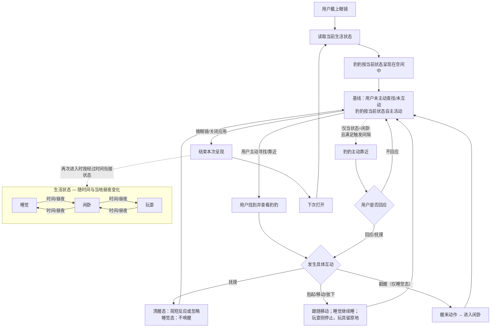

# 豹豹 — 体验与原型

[Scout 入口](README.md) · [项目入口](../README.md)

本文的“原型”专指后续眼镜上的最小可实现原型；网页功能原型统一称 Functional Web Prototype（FWP）。FWP用简化房间和鼠标或触控检查生活状态、互动反馈与时间衔接。0.1.0 已有本地可运行版本和静态发布包；独立链接访问仍是交付目标，公开部署和用户试用尚未完成。实际交付范围与已知差异见[验证与下一步](04-validation-and-next-steps.md)。

## 1. 体验概述

豹豹通过眼镜出现在真实空间中，与用户共处。用户打开豹豹时，它已经在睡觉、闲卧或玩耍，不需要用户先发起互动。

## 2. 生活状态

豹豹有睡觉、闲卧和玩耍三种生活状态，随时间和当地昼夜自然变化。用户不直接切换状态，但可以戳醒睡着的豹豹。

| 状态 | 行为表现 | 用户互动后的变化 |
|---|---|---|
| 睡觉 | 闭眼休息，有呼吸起伏和偶尔调整睡姿的小动作，不主动靠近用户。 | 被抱起、移动或放下时继续睡。被戳醒后，先醒来、舒展或观察周围，再进入清醒状态，不一定立即互动。 |
| 闲卧 | 清醒地休息，伸展、整理姿态，偶尔观察周围。 | 可以回应用户，也可以继续自己的活动。 |
| 玩耍 | 自己拨弄一个固定玩具，不要求用户参与。 | 可以暂时不回应。被抱起时停止玩耍，玩具留在原处；放下后可以闲卧，不必立即返回玩具旁。 |

夜间更容易睡觉，白天相对活跃，但不采用固定作息。各状态的持续时间和切换频率先通过 FWP 调试，再在眼镜原型中复查。

## 3. 用户互动

| 用户操作 | 豹豹的表现 |
|---|---|
| 抚摸 | 清醒时可能作出简短反应，也可能继续自己的活动；睡着时不会因此醒来。 |
| 抱起、移动与放下 | 随用户移动到新的位置。睡着时继续睡；玩耍时停止玩耍，玩具留在原处。 |
| 戳醒 | 结束睡眠，经过醒来的动作后进入清醒状态，不立即强制开始玩耍。 |
| 不回应主动靠近 | 豹豹结束这次接触，继续自己的活动，不连续催促，也不因此疏远用户。 |

## 4. 空间活动与寻找

### 原型空间范围

最小原型先在一个经过设置和测试的室内区域运行，包含一块可活动的地面和一个可放置豹豹的平面，暂不支持跨房间活动。

可用平面及空间设置方式根据设备能力确定，不要求原型进入任意陌生房间都能立即运行。

### 移动与寻找

豹豹可以在地面自主活动，也可以由用户抱到已设置的可放置平面上。

在线呈现时，豹豹不自行跳跃或攀爬，上下高处由用户完成。用户离开较久后，再次出现的位置允许跨高度变化，衔接规则见第 5 节。

第一期不提供定位提示，用户通过观察空间寻找豹豹。

## 5. 离开与再次相遇

用户可以关闭应用或摘下眼镜，结束相处。第一期不设置单独的隐藏、显示或暂停按钮。

短暂摘戴眼镜时，豹豹的位置和动作保持自然衔接。离开较久后，豹豹根据经过的时间和当地昼夜，呈现新的活动与位置，不必停留在离开时的状态。离线期间允许跨高度换位置，例如从床或矮榻回到地面；这不要求呈现自主跳跃或攀爬动作。

再次出现时，豹豹应位于用户能够发现和接触的位置，不完全藏在家具后或进入无法触及的区域。离开多久后允许明显换位置，先通过 FWP 调试，再在眼镜原型中复查。

生活随时间推进不要求应用持续在后台运行。

## 6. 最小原型范围

原型以一只豹豹、一个经过设置和测试的室内区域和一个固定玩具，呈现日常共处与简单互动。

| 范围 | 原型需要呈现什么 |
|---|---|
| 空间活动 | 豹豹在地面小范围活动，可由用户抱到已设置的可放置平面上；在线不自行跳跃或攀爬，离开较久后允许跨高度换位置，不跨房间活动。 |
| 日常生活 | 睡觉、闲卧和玩耍，以及状态之间的自然衔接。作息受当地昼夜影响。 |
| 用户互动 | 抚摸、抱起、移动、放下和戳醒。具体输入方式根据设备能力确定。 |
| 主动接触 | 偶尔靠近用户；用户没有回应时，继续自己的活动，不连续催促。 |
| 再次相遇 | 短暂摘戴保持连贯；离开较久后，活动与位置可以变化。 |
| 进入与退出 | 打开应用开始体验，关闭应用或摘下眼镜结束相处，不设置独立控制按钮。 |

第一期不提供定位提示、单独的招呼或拒绝操作，也不包含对话、喂食、抛球任务、多只宠物和户外使用。

### 开始试用前的基本检查

- 用户走动、转头时，豹豹不会明显漂移或穿过家具。
- 没有用户输入时，豹豹也能连贯地活动，睡觉、闲卧和玩耍可以区分。
- 抚摸不唤醒睡着的豹豹；戳醒有醒来过程；睡着时被抱起仍继续睡。
- 正在玩耍时被抱起，豹豹停止玩耍，玩具留在原处。
- 主动靠近未获回应后自然结束，不连续催促。
- 退出后停止呈现和互动；再次进入时，位置与状态按约定规则衔接，豹豹能够被找到和接触。

## 7. FWP 的对应范围

FWP不做主动靠近对照版。用简化房间、鼠标或触控表达上述三种生活状态、一个固定玩具、抚摸、抱起移动放下、戳醒、偶尔主动靠近以及时间衔接。关闭页面、切换标签页和再次进入按浏览器实际条件处理，不用“摘下眼镜”描述网页行为。

FWP可用于调整生活状态、互动反馈、时间衔接和了解相处感受，不能验证真实房间共处的价值、空间互动可靠性或眼镜佩戴成本。
