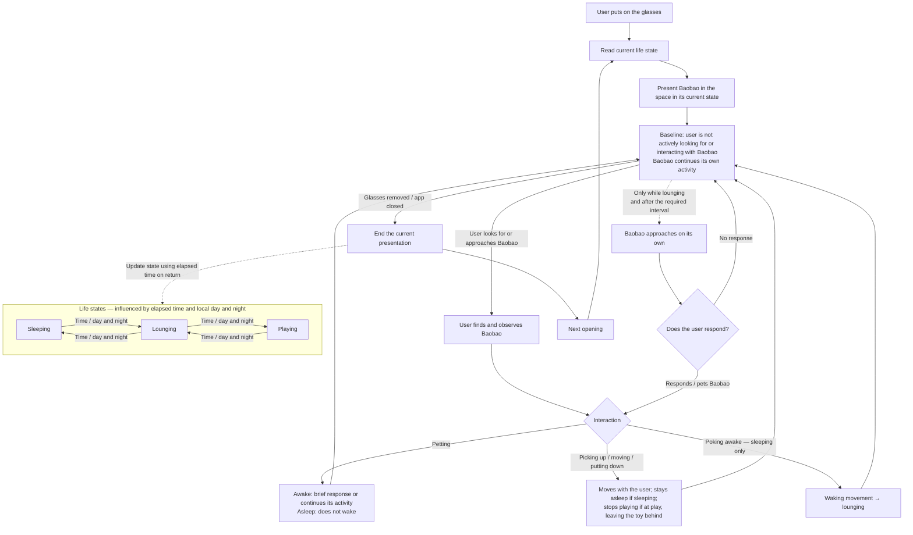

# Baobao — Experience and Prototype

[Scout index](README.md) · [中文](../01_Scout_CN/03-experience-and-prototype.md) · [Project index](../README.md)

In this document, “prototype” on its own refers to the minimum feasible prototype on glasses. The web version is called the **Functional Web Prototype (FWP)**. It uses a simplified room and mouse or touch input to examine life states, interaction feedback, and continuity over time. Version 0.1.0 is available as a locally runnable build and a static deployment package. Access through a standalone link remains a delivery goal; public deployment and user trials have not yet been completed. See [Validation and Next Steps](04-validation-and-next-steps.md) for what has been delivered and known gaps.

## 1. Experience overview

Baobao appears in the real space through the glasses and shares it with the user. When the user opens the app, Baobao is already sleeping, lounging, or playing; it does not wait for the user to initiate an interaction.

## 2. Life states

Baobao has three life states: sleeping, lounging, and playing. They change naturally with elapsed time and local day and night. Users do not switch states directly, but can poke a sleeping Baobao awake.

| State | Behavior | Changes following user interaction |
|---|---|---|
| Sleeping | Rests with eyes closed, visible breathing, and occasional small changes of sleeping position. Does not approach the user. | Stays asleep when picked up, moved, or put down. When poked awake, wakes, stretches, or looks around before becoming fully awake; does not necessarily interact immediately. |
| Lounging | Rests while awake, stretches, adjusts its posture, and occasionally looks around. | May respond to the user or continue its own activity. |
| Playing | Plays on its own with one consistent toy, without requiring user participation. | May not respond for a while. Stops playing when picked up, leaving the toy where it was. After being put down, may lounge rather than immediately return to the toy. |

Baobao is more likely to sleep at night and be active during the day, but does not follow a fixed schedule. State durations and transition frequency will first be tuned in the FWP and then revisited in the prototype on glasses.

## 3. User interactions

| User action | Baobao's behavior |
|---|---|
| Petting | While awake, may respond briefly or continue its activity. While asleep, does not wake. |
| Picking up, moving, and putting down | Moves with the user to a new position. Stays asleep if sleeping; stops playing if at play, leaving the toy behind. |
| Poking awake | Ends sleep, goes through a waking movement, and becomes awake without being forced straight into play. |
| Not responding to an approach | Ends this attempt at contact and resumes its own activity, without repeated prompting or becoming distant toward the user. |

## 4. Movement and finding Baobao

### Spatial scope of the prototype

The minimum prototype runs in one indoor area that has been set up and tested in advance. It includes a patch of floor for movement and one surface on which Baobao can be placed. Movement between rooms is outside the initial scope.

Usable surfaces and setup methods depend on the selected device. The prototype does not need to work immediately in any unfamiliar room.

### Movement and discovery

Baobao can move independently on the floor. Users can also pick it up and place it on the configured surface.

During an active session, Baobao does not jump or climb on its own; users move it up to or down from elevated surfaces. After a longer absence, its new location may be at a different height. Section 5 defines the continuity rules.

The first version has no location hints. Users find Baobao by looking around the space.

## 5. Leaving and meeting again

Users can end their time with Baobao by closing the app or taking off the glasses. The first version has no separate hide, show, or pause controls.

Briefly removing and putting the glasses back on should preserve natural continuity in Baobao's position and movement. After a longer absence, its activity and location reflect elapsed time and local day and night rather than necessarily remaining as the user left them. While the user is away, Baobao may change locations across different heights, for example returning from a bed or low bench to the floor. This does not require showing autonomous jumping or climbing.

On return, Baobao should be somewhere the user can find and reach, rather than completely hidden behind furniture or in an inaccessible area. The length of absence that permits a noticeable location change will first be tuned in the FWP and then reviewed in the prototype on glasses.

Progression over time does not require the app to run continuously in the background.

## 6. Minimum prototype scope

The prototype uses one Baobao, one prepared and tested indoor area, and one consistent toy to present everyday time together and simple interactions.

| Area | What the prototype needs to show |
|---|---|
| Spatial activity | Baobao moves within a small floor area and can be carried onto a configured surface. It does not jump or climb during an active session; after a longer absence, it may reappear at a different height. It does not move between rooms. |
| Everyday life | Sleeping, lounging, and playing, with natural transitions. Its rhythm is influenced by local day and night. |
| User interaction | Petting, picking up, moving, putting down, and poking awake. Input methods depend on device capabilities. |
| Self-initiated contact | Occasionally approaches the user; if unanswered, resumes its activity without repeated prompting. |
| Returning | Brief removals of the glasses preserve continuity; activity and location may change after longer absences. |
| Entry and exit | Opening the app starts the experience; closing it or removing the glasses ends it. No separate session controls. |

The first version excludes location hints, dedicated greeting or rejection actions, conversation, feeding, ball-throwing tasks, multiple pets, and outdoor use.

### Basic checks before user trials

- Baobao does not visibly drift or pass through furniture when the user walks or turns their head.
- Without user input, its activity remains coherent and sleeping, lounging, and playing are distinguishable.
- Petting does not wake a sleeping Baobao; poking awake includes a waking transition; being picked up while asleep does not wake it.
- Picking Baobao up during play stops the play and leaves the toy in place.
- An unanswered approach ends naturally without repeated prompting.
- Exiting stops presentation and interaction. Returning follows the agreed position and state continuity rules, with Baobao somewhere discoverable and reachable.

## 7. Corresponding FWP scope

The FWP does not include a separate comparison version for proactive approaches. A simplified room and mouse or touch input represent the same three life states, one consistent toy, petting, picking up and moving, putting down, poking awake, occasional approaches, and continuity over time. Page closure, tab switching, and re-entry are handled as browser events, not described as “taking off the glasses.”

The FWP can help refine life states, interaction feedback, and continuity, and explore how users feel about spending time together. It cannot validate the value of sharing a real room, the reliability of spatial interaction, or the burden of wearing glasses.
